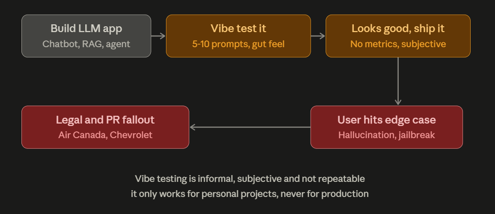
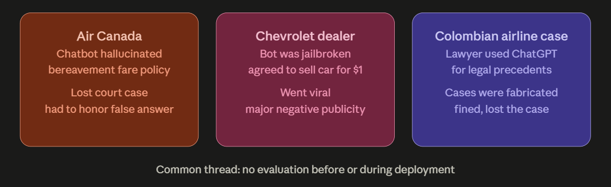
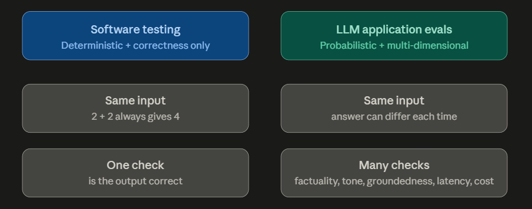
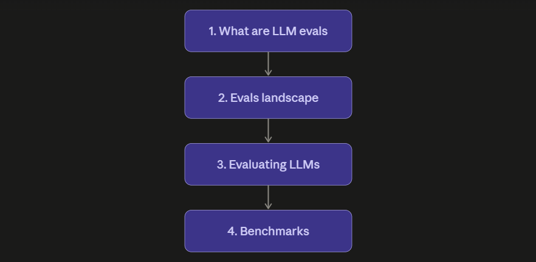
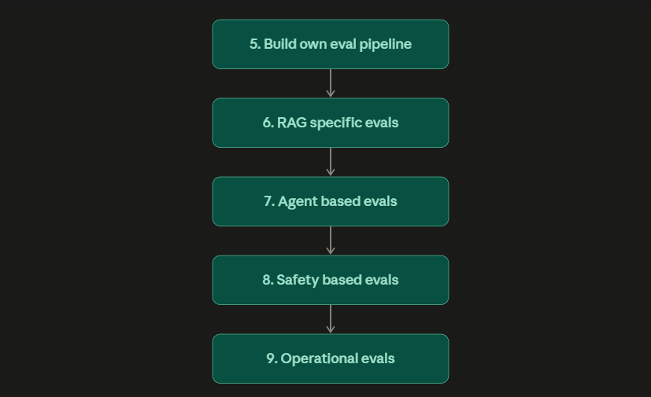

### **LLM Evals — Introduction (Revision Notes)**

### **What is an AI Engineer**
- Someone who builds applications and products on top of foundation models (LLMs)
- Common skills already covered: LangChain, RAG chatbots, agents, LangGraph, CrewAI, Agno, LangSmith, prompt engineering, no-code tools like n8n
- These are common skills — everyone preparing for AI Engineer roles studies them

### **New topic: LLM Evals**
- Teaches how to evaluate LLM-based applications before/after deployment
- Decides whether an application is ready for production
- Commonly asked in Gen AI interviews: "How do you evaluate your RAG application / agentic application?"
- Benefits of learning this
  - Competitive edge — very few people study evals seriously
  - Mindset shift — from "build to show interviewer" to "build to serve millions of users"

### **Vibe Testing — the common mistake**
- Definition: casually trying an LLM app with a few prompts and judging by feel
- No metrics, purely subjective
- Problems
  - Informal
  - Subjective
  - Not repeatable
  - Only works for personal projects, not production

### **Case Study 1 — Air Canada**
- Chatbot hallucinated about bereavement fare policy
- Told customer wrong info (pay full price, refund later — actual policy was opposite)
- Customer sued in court
- Air Canada argued chatbot was a "separate entity" — court rejected this
- Result: Air Canada lost, had to refund the customer, reputational damage

### **Case Study 2 — Chevrolet dealer chatbot**
- Dealer's chatbot was jailbroken by a user
- User emotionally manipulated bot into agreeing to sell a car for $1
- Bot gave a written, documented offer
- User posted screenshots on social media
- Result: major negative publicity for dealership and Chevrolet

### **Case Study 3 — Colombian airline lawsuit**
- Passenger injured by an in-flight beverage cart, sued airline
- Passenger's lawyer used ChatGPT to find past similar case precedents
- ChatGPT hallucinated fake case names, dates, and details
- Lawyer did not verify, presented fake cases in court
- Result: judge found cases didn't exist, lawyer and firm fined ~$5000, lost the case

### **Key lesson from all 3 cases**
- Evaluation is not optional — it is essential before and after deployment
- Unevaluated LLM apps can cause legal, financial, and reputational damage

### **Why isn't everyone doing evals already**
- Evaluating LLM apps is not straightforward — trickier than testing normal software

### **Software Testing vs LLM Application Evals — 2 key differences**

**1. Deterministic vs Probabilistic**
- Software: same input always gives same output (e.g. calculator: 2+2=4 always)
- LLM apps: same input can give different outputs each time (probabilistic by nature)
- Example: asking "what is overfitting" gives different phrasing each time — none wrong

**2. Single check vs Multi-dimensional check**
- Software: only one benchmark — correctness (right or wrong)
- LLM apps: many dimensions to evaluate
  - Factuality
  - Completeness
  - Tonality
  - Groundedness
  - Latency
  - Cost
- These dimensions vary application to application

### **Playlist Roadmap (10 topics, in order)**
1. What LLM Evals are (with example)
2. Full landscape of LLM Evals — techniques, tools, high-level overview
3. Evaluating LLMs (the model itself)
4. Benchmarks — categories of benchmarks used when new models release
5. Evaluating LLM-based applications
6. Build own eval pipeline — curate golden dataset, define rubrics, run on own app
7. RAG-specific evals
8. Agent-based evals
9. Safety-based evals
10. Operational evals — latency, tokens/sec, time-to-first-token, system load (post-deployment monitoring)

### **One-line takeaway**
- Vibe testing = feel-based, unreliable, personal-project-only
- LLM Evals = structured, repeatable, multi-dimensional, production-ready evaluation