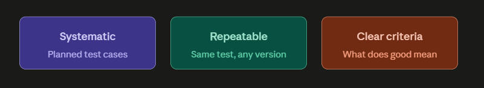
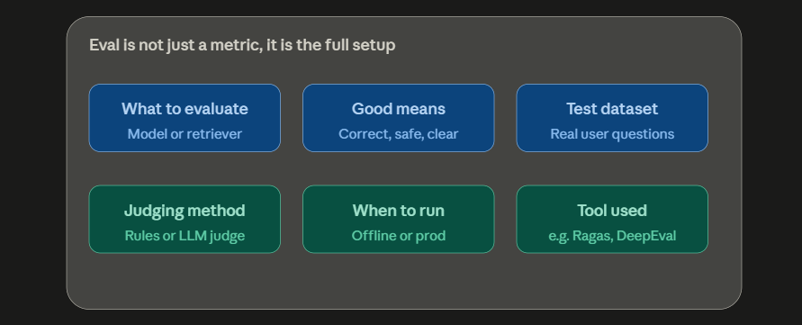
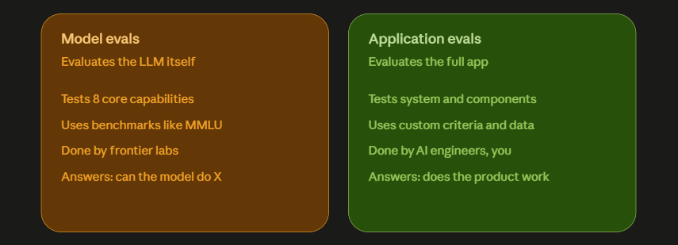
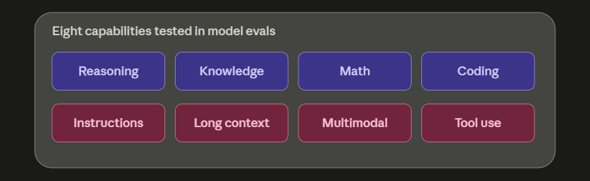
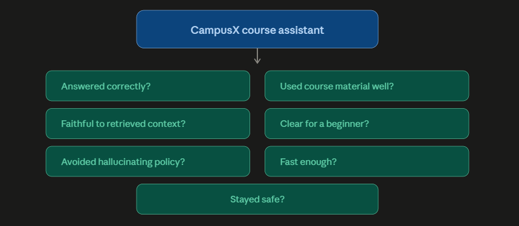

## **LLM Evals - Quick Revision Notes**

### **Definition**
- LLM evals = systematic, repeatable tests used to judge an LLM or LLM powered system against a clear criteria.

### **1. Systematic**
- Not random / vibe testing.
- Build proper datasets covering edge cases.
- Example: 100 real student doubts for a CampusX course assistant.

### **2. Repeatable**
- Same eval should be runnable again and again.
- Change prompt, model, retriever, chunking strategy, system instruction - still run the same test.
- Lets you compare version 1 vs version 2 objectively.

### **3. Clear criteria**
- Must define what "good" means before evaluating.
- Example, for CampusX assistant a good answer is:
  - Correct
  - Simple explanation
  - Grounded in course content
  - Safe and policy-compliant
- Without criteria = only vibes.

### **Eval is not just a metric**
- An eval is the complete testing setup, including:
  - What are we evaluating
  - What does good mean
  - What test cases are we using
  - How are we judging the output
  - When are we running it (offline / production)
  - Which tool are we using

### **Goal of LLM evals**
- Not just a score. Answers practical questions:
  - Can the model be used for a particular task/application?
  - Is this system good enough to ship?
  - Did prompt v2 improve over prompt v1?
  - Is the RAG answer grounded in retrieved context?
  - Is the agent completing the task correctly?
  - Is the chatbot safe for real users?
  - Is the latency under control?

---

### **Two Types of LLM Evals**

### **A. Model Evals**
- Evaluate the model itself (the LLM).
- Goal: test and document a new LLM's capabilities.
- Not usually done by AI engineers, done by frontier labs.
- Still important to know how to read benchmarks for model selection.

**Eight core capabilities tested:**
1. Reasoning
2. Knowledge
3. Basic math
4. Coding
5. Instruction following
6. Long context handling
7. Multimodal understanding
8. Tool use

**Famous benchmarks:**

| Capability Area | Benchmark(s) | What It Checks |
|---|---|---|
| General knowledge + reasoning | MMLU | Broad subject knowledge and reasoning across science, history, law, medicine |
| Maths | GSM8K | Grade-school math word problems, step by step reasoning |
| Coding | HumanEval, SWE-bench | Code generation and real-world software engineering tasks |
| Instruction following | IFEval | Whether the model follows explicit constraints and formatting |
| Long context | Needle-in-a-Haystack | Finding specific info hidden in a very long context |
| Multimodal | MMMU | Reasoning over images, diagrams, charts |

### **B. Application Evals**
- Evaluate the entire LLM powered application, not just the model.
- Main focus of this course - only one dedicated lecture on model evals.
- LLM is just one component of an app; other parts also need evaluation:
  - UI, system prompt, tools/APIs, orchestration code, guardrails, output parsers, memory/context, retriever, embedding model, vector DB, monitoring, feedback loop.

**Smartphone analogy**
- A strong processor (chip benchmark) alone doesn't make a good smartphone.
- Camera, OS, sound system, graphics, battery - all matter together.
- Same way, a strong LLM (model eval) alone doesn't make a good application - the whole system around it needs evaluation too (application eval).

**Application evals ask:** does the product work, not just "can the model do this".

Levels of evaluation:
- Whole system level (final response, latency, cost per token)
- Component level (retriever accuracy, embedding model, reranker)

**Example - CampusX course assistant, application evals check:**
- Did it answer the student's question correctly?
- Did it use the course material properly?
- Was the answer faithful to the retrieved context?
- Was it clear for a beginner?
- Did it avoid hallucinating policies?
- Did it respond quickly enough?
- Did it stay safe?

### **Why this course focuses on application evals**
- Building LLM apps is the AI engineer's job, so evaluating them is too.
- "LLM evaluation" content online, 99% of the time, means application eval, not model eval.

---

### **One Line Summary Per Section**
- Why - evals needed because LLM behavior is non-deterministic, unlike normal software testing.
- What - LLM evals = systematic + repeatable tests + clear criteria, split into model evals and application evals.
- How (next) - taught from the application eval perspective.