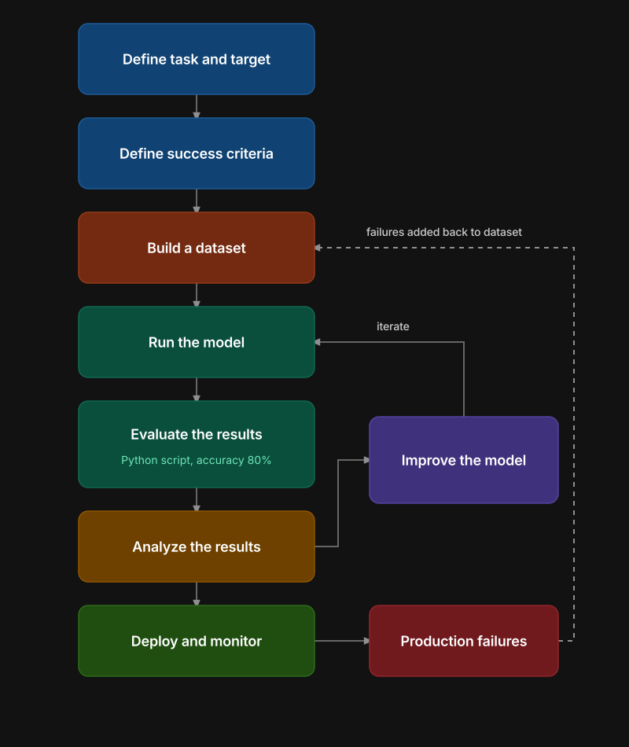

### **LLM Application Eval Workflow - Quick Revision Notes**

### **Recap of Part 1**
- Why - evals needed, LLMs are non-deterministic unlike normal software.
- What - LLM evals = systematic + repeatable tests + clear criteria.
- Two types: model evals (evaluate the LLM), application evals (evaluate the full app).
- This lecture's how is taught from the application eval perspective.

### **Example App - Zomato Email Classifier**
- Company (Zomato) gets many customer emails daily.
- Goal: automate reading + classifying emails into billing / technical / general.
- Why: route billing to billing team, technical to technical team, general to support team.
- Built in minutes: one LLM with a prompt acting as a classification agent.
- Flow: company -> Zomato -> mails -> LLM system -> billing / technical / general.
- Question before deploying: can we ship this directly? No - must evaluate first.

---

### **The Application Eval Workflow (10 Steps)**

### **1. Define task and target**
- What are we evaluating - here, the whole classification system/workflow.

### **2. Define success criteria**
- Task type: classification.
- Metric: accuracy (e.g. 90 out of 100 correctly routed = 90% accurate).

### **3. Build a dataset**
- Format: input message column + expected label column.
- Example rows:
  - "My card was charged twice" -> billing
  - "The app crashes on login" -> technical
  - "What are your hours?" -> general
- Real world size: 50 to 500 rows.
- Best source: your own real past data (e.g. past chats), labeled manually.
- Industry term: golden dataset.

### **4. Define an evaluation method**
- Who checks correctness - three options:
  - Automated (plain code, e.g. Python accuracy check) - good for simple/exact outputs like classification labels.
  - Human - accurate but costly, not scalable.
  - LLM as judge - middle ground, needed when comparing long free-text answers (semantic comparison, not exact match).

### **5. Run the model**
- Send the dataset through your built system, generate answers for every row.

### **6. Evaluate the results**
- Script calculates the metric, e.g. accuracy = 80%.

### **7. Analyze the results**
- Investigate where and why mistakes are happening.
- Common fixes:
  - Tweak the system prompt (may be causing confusion between categories).
  - Change the model (weak/low-parameter model may not be capable enough).

### **8. Improve the system**
- Apply the fix identified in analysis (prompt or model change).
- Note: improve the system, not just "the model".

### **9. Iterate**
- Re-run evaluation on the same golden dataset after every change.
- Example progression: 80% -> tweak prompt -> 90% -> change model -> 95% -> stop when satisfied.
- This is the repeatability property of evals in action.

### **10. Deploy and monitor**
- Once satisfied, deploy the system online.
- Work does not stop after deployment - must monitor continuously.
- Production data can behave differently than test data, causing new failures.

---

### **Handling Production Failures**
- When a real failure happens (e.g. billing email misrouted to technical team):
  - Case gets flagged (e.g. by the technical team receiving a wrong routing).
  - That specific example gets added back into the golden dataset.
  - Full evaluation loop restarts using the enriched dataset.
- Result: golden dataset keeps getting richer over time, system keeps improving.
- This creates one large continuous loop that runs for as long as the system is live.
- Same exact workflow applies to RAG systems and to agents, not just this simple classifier example.

### **Who Flags a Wrong Output in Production**
- Example: customer's billing issue misrouted to technical team.
- Technical team follows up, realizes it's not their issue, flags it as incorrect routing.
- This flagged case becomes part of the monitoring/feedback process and gets added to the dataset.

---

### **Important Point to Remember**
- One LLM based application may have (or often has) several LLM evals, not just one.
- Example for a RAG app - separate evals can exist for:
  - Retriever performance
  - Embedding model performance
  - Full RAG workflow (end to end)
  - System latency
- Generally, a single application is evaluated using multiple evals, not a single one.

---

### **Full Workflow - One Line Each**
1. Define task and target - what are we testing
2. Define success criteria - metric to judge success
3. Build a dataset - the golden dataset
4. Define eval method - automated / human / LLM judge
5. Run the model - generate outputs on the dataset
6. Evaluate the results - calculate the metric
7. Analyze the results - find where/why it fails
8. Improve the system - fix prompt or model
9. Iterate - repeat steps 5-8 until satisfied
10. Deploy and monitor - ship it, then watch it
    - Production failures -> added back to dataset -> loop restarts