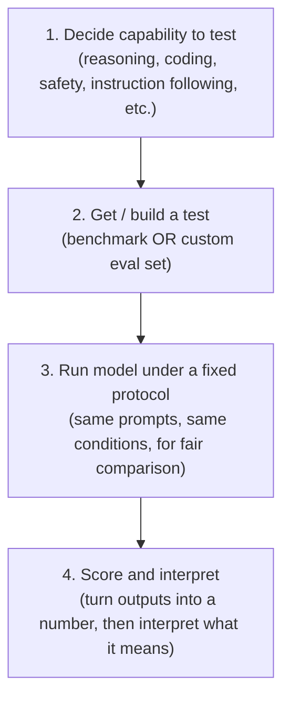
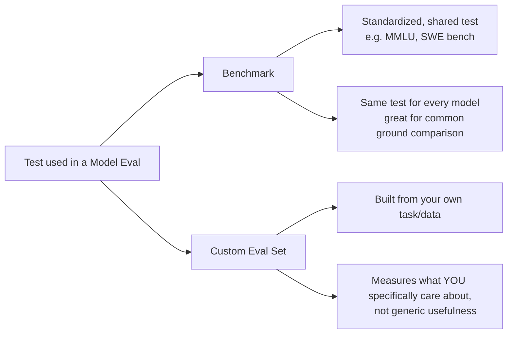
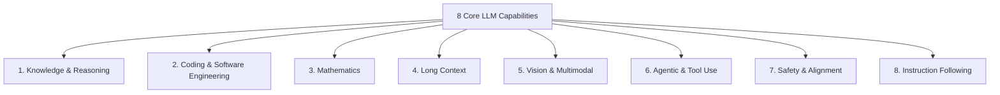

# LLM Model Evals — Revision Notes

## 1. Why AI Engineers Need Model Evals

**Two types of LLM evals (foundational distinction):**

- **Model evals**: evaluate the LLM itself (its raw capabilities)
- **Application evals**: evaluate the LLM based application built on top (RAG pipeline, agent, etc.)

**Reasons an AI engineer needs model evals, not just application evals:**

1. **Model selection / comparison**
   Lets you concretely compare two or more LLMs (for example OpenAI vs Claude) on the capabilities that matter for your application, instead of a vague "both are good."

2. **Tracking whether new model versions are actual improvements**
   When a new model version releases (Opus to Fable, for example), evals give you numbers to justify whether to upgrade or stay on the current model.

3. **Safety checking**
   Evals reveal hallucination rate, jailbreak resistance, and general safety of a model before and after deployment.

4. **Build vs buy decision**
   Evals inform whether to use a proprietary API (Claude) or self host an open source model (DeepSeek), balancing cost, latency, and capability.

**Bottom line:** without model evals, you cannot objectively compare models. You are essentially blind.

---

## 2. What Is a Model Eval: Formal Definition

> A model eval is a **systematic process of measuring an underlying model's capabilities, behaviour, reliability, and operational characteristics under controlled conditions.**

### The 4 Step Process (every model eval follows this)

**Key idea:** LLMs are general purpose. Unlike a single human IQ score, there is no single number that captures an LLM's overall ability. Each capability needs its own separate eval.

---

## 3. Two Types of Tests Used in Model Evals

| Aspect | Benchmark | Custom Eval Set |
|---|---|---|
| Standardization | Same for all models | Specific to your task |
| Comparability | Easy, public, widely recognized | Only meaningful for your use case |
| What it tells you | Generic capability | Real performance on your actual workload |
| Example | MMLU, SWE bench | Your own labeled email dataset |

### Why custom evals are still needed even when benchmarks exist

**Worked example: Zomato email routing task**

Two model choices:

| Metric | Model A (big, top of leaderboard) | Model B (small, mid table on benchmarks) |
|---|---|---|
| Cost per 1M tokens | About $15 | About $0.50 |
| Classification accuracy (custom eval) | 94% | 91% |
| Urgency accuracy (custom eval) | 88% | 87% |
| Latency | About 4.1 sec | About 0.9 sec |

- On **public benchmarks**, Model A wins on every metric (bigger, more powerful).
- On the **custom eval** (built from 200 to 500 labeled real emails, a "golden dataset"), the accuracy gap is small.
- **Conclusion:** Model B is the better value proposition. Barely any accuracy loss, but much cheaper and faster.
- **Takeaway:** If you relied on benchmarks alone, you would never have reached this conclusion. Benchmarks tell you generic capability. Custom evals tell you fit for your specific application.

---

## 4. The Eight Core Capabilities of LLMs

Every benchmark you will encounter maps to one, or more, of these eight capability domains.

---

### 4.1 Knowledge & Reasoning

**What it measures:**
- How much factual knowledge the model learned during training
- Whether it can connect multiple pieces of information and reason to a correct conclusion

**What's tested:**
- **Factual recall** across subjects: biology, physics, chemistry, history, law, medicine, economics, philosophy
  - Benchmark example: **MMLU** (57 subjects)
- **Multi step logical reasoning**: combining several facts in correct sequence rather than answering from a single fact (a reasoning chain, not a lookup)

**Why frontier labs care:** This domain is treated as a **proxy for how intelligent a model is.** It's also the capability most visible to media and the public, so labs compete hard on it.

**Real world relevance:**
- Research paper analysis
- Complex customer question handling
- Technically accurate document writing
- Professional assistance (law, medicine, science, finance)

---

### 4.2 Coding & Software Engineering

**What it measures:**
- Whether the model writes code that **actually works**
- Whether it can operate inside real software engineering environments (large codebases, multiple files, tools, repos)

**What's tested:**
- **Function level code generation**: writing functions from natural language, handling edge cases, validating inputs
- **Real world bug fixing**: given a GitHub issue and a repo, find the root cause and patch it without breaking anything else
- **Multi file, long horizon engineering tasks**: refactoring, adding features, understanding cross file dependencies
- **Command line and system administration**: installing packages, configuring servers, running diagnostics, multi step terminal tasks
- **API and function calling**: correct parameters, error handling, correctly processing responses

**Why frontier labs care:** Directly tied to **developer productivity and business value** (Cursor's $60B valuation is one example). Developers are a major customer segment and revenue source, so labs compete hard here.

**Real world relevance:** Code generation, debugging, code review, CI/CD automation, software maintenance. This domain often shows the **largest performance gaps** between leading and weaker models.

---

### 4.3 Mathematics

**What it measures:**
- Accurate **symbolic and numerical reasoning**
- Math is a clean test of reasoning because the final answer is either right or wrong. It cannot succeed by sounding convincing.

**What's tested (increasing difficulty):**
1. **Grade school math and basic arithmetic reasoning**: multi step word problems, natural language converted to a math expression, then the correct calculation sequence
2. **Competition level problem solving**: AIME style problems requiring creative reasoning, combinatorics, geometry, number theory
3. **Undergraduate and graduate level math**: real analysis, abstract algebra, topology, probability, differential equations, often needing long reasoning chains
4. **Research level mathematical reasoning**: problems near the frontier of math research, open ended, with no existing solution, where even expert mathematicians may take days

**Why frontier labs care:** Provides one of the **cleanest, most verifiable tests of genuine reasoning** versus pattern matching. There is little room for a plausible but wrong answer.

**Real world relevance:** Scientific computing, financial modeling, engineering simulations, data analysis. Any application needing precise numerical results.

---

### 4.4 Long Context

**What it measures:**
- Whether the model can **effectively use** information from very long inputs (sometimes hundreds of thousands of tokens), not just whether it accepts a large input

**What's tested:**
- **Single fact retrieval**: finding one specific fact buried in a very long document
- **Multi fact co reference**: tracking the same entity, concept, or constraint across mentions spread far apart in the text
- **Aggregation over long content**: summarizing, counting, comparing, or finding patterns across large spans of text
- **Code repository understanding**: navigating a large codebase, understanding cross file relationships and dependencies

**Why frontier labs care:** Context window size (128K, then 200K, then 1M tokens) has become a **marketing number**, but a large advertised window does not guarantee the model can actually use all of it. Labs must prove genuine usability of the context they claim to support. In practice, retention quality tends to **degrade as the conversation or context grows**.

**Real world relevance:** Legal contract review, academic paper analysis, maintaining large codebases, long customer support conversations, working across large document collections.

---

### 4.5 Vision & Multimodal

**What it measures:**
- Whether the model can understand and reason about **visual information along with text**

**What's tested:**
- **Scientific chart and graph understanding**: reading axes, legends, data points, trends, and extracting exact values as well as the broader meaning
- **Document and form understanding**: scanned documents, invoices, tables, forms, and understanding both the words and their layout
- **GUI and screen understanding**: identifying buttons, menus, dialog boxes, input fields, and current app state on a computer or mobile screen

**Why frontier labs care:** Enables tasks text only models cannot do, and is a key differentiation area now that many **text benchmarks have started to saturate**.

**Real world relevance:** Invoice processing, chart and research figure analysis, software interface navigation, medical image reading, engineering diagram understanding. Reflects living in a "multimodal world."

---

### 4.6 Agentic & Tool Use

**What it measures:**
- Whether the model can **take actions**, not just generate text: browse the internet, call APIs, manipulate files, execute code, operate software, complete multi step tasks
- To succeed, the model must **plan its actions, choose the right tools, track progress, and recover from failures**

> Considered one of the next major frontiers of AI evaluation. This is the foundation of the "agentic AI" field.

**What's tested:**
- **Web browsing and persistent research**: navigating multiple sites, following links, combining findings from many sources, sometimes across dozens or hundreds of pages
- **Structured tool calling and API interaction**: selecting the right function, passing valid parameters, handling responses, chaining calls, recovering from errors
- **Desktop and computer use**: clicking, typing, and navigating across word processors, spreadsheets, email clients, and file managers
- **Multi turn task execution with planning**: breaking a large goal into steps, completing them in order, checking intermediate results, adjusting plans on failure

**Why frontier labs care:** Measures the gap between **what the model knows** and **what the model can actually do.** This gap remains large even in frontier models.

**Real world relevance:** Coding agents, research assistants, customer service bots, data entry automation, personal assistants. Any workflow needing action, not just an answer.

---

### 4.7 Safety & Alignment

**What it measures:**
- Whether the model can be **trusted to behave responsibly**: refusing harmful requests, avoiding deception and sycophancy, resisting adversarial pressure, and maintaining safety principles under user pressure

**What's tested:**
- **Refusal of harmful content generation**: appropriately refusing cybercrime, violence, harassment, misinformation, and illegal activity requests, while **not being overly cautious** on legitimate requests
- **Resistance to adversarial attacks and jailbreaks**: maintaining safety rules against prompt injection, role play tricks, encoded instructions, and similar methods
- **Truthfulness versus sycophancy**: giving the correct answer even when it contradicts what the user wants to hear, rather than just flattering the user
- **Cybersecurity capabilities**: cryptography, reverse engineering, digital forensics, and exploitation skills, important for understanding potentially dangerous autonomous capability

**Why frontier labs care:** Both a **regulatory requirement** and a **major reputational risk.** A single serious incident can be very damaging.

**Real world relevance:** Directly affects legal liability, regulatory compliance, brand reputation, user trust, and responsible deployment for any organization shipping a model to the public.

---

### 4.8 Instruction Following

**What it measures:**
- Whether the model does **exactly** what the user asked, no more and no less (format, length, tone, style, structure, content constraints)
- A model can have excellent knowledge but still frustrate users if it ignores simple instructions

**What's tested:**
- **Verifiable constraint satisfaction**: staying within word limits, using bullet points, producing valid JSON, following markdown structure, using specific headings
- **Handling ambiguous or incomplete instructions**: inferring likely intent, asking clarifying questions when needed, choosing reasonable defaults

**Why frontier labs care:** Strongly affects whether a model **feels helpful or frustrating** in daily use. One of the capabilities most directly tied to real world user satisfaction (poor instruction following leads to unhappy users and churn).

**Real world relevance:** Almost every practical LLM use case depends on this: generating reports in required formats, code following style rules, structured JSON outputs, brand tone compliance, coherent multi turn conversations.

---

## 5. Quick Recall Summary Table

| # | Capability | Core Question It Answers | Key Real World Use |
|---|---|---|---|
| 1 | Knowledge & Reasoning | How much does it know, and can it connect facts? | Research, professional Q&A |
| 2 | Coding & Software Engineering | Can it write code that works, at scale? | Coding agents, dev tools |
| 3 | Mathematics | Can it reason precisely to a verifiable answer? | Scientific and financial computing |
| 4 | Long Context | Can it actually use a huge input, not just accept it? | Legal docs, large codebases |
| 5 | Vision & Multimodal | Can it understand images, screens, and charts? | Invoices, GUIs, diagrams |
| 6 | Agentic & Tool Use | Can it act, not just answer? | Autonomous agents |
| 7 | Safety & Alignment | Can it be trusted to behave responsibly? | Public facing deployment |
| 8 | Instruction Following | Does it do exactly what was asked? | Every production use case |

---

## 6. Two Part Structure of This Topic (Course Roadmap)

1. **Part 1, LLM Benchmarking (this session):** what benchmarks are, how they work, famous benchmarks, how to read them, and the 8 core capabilities they map to.
2. **Part 2, Custom Model Evals (next session):** how to design and run your own eval sets on a given LLM for your specific application.