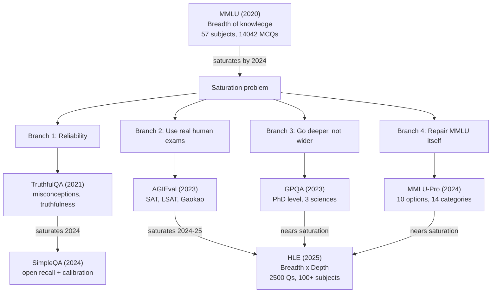
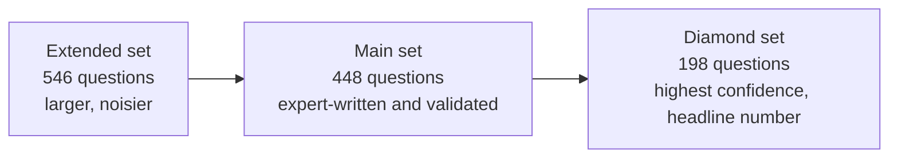
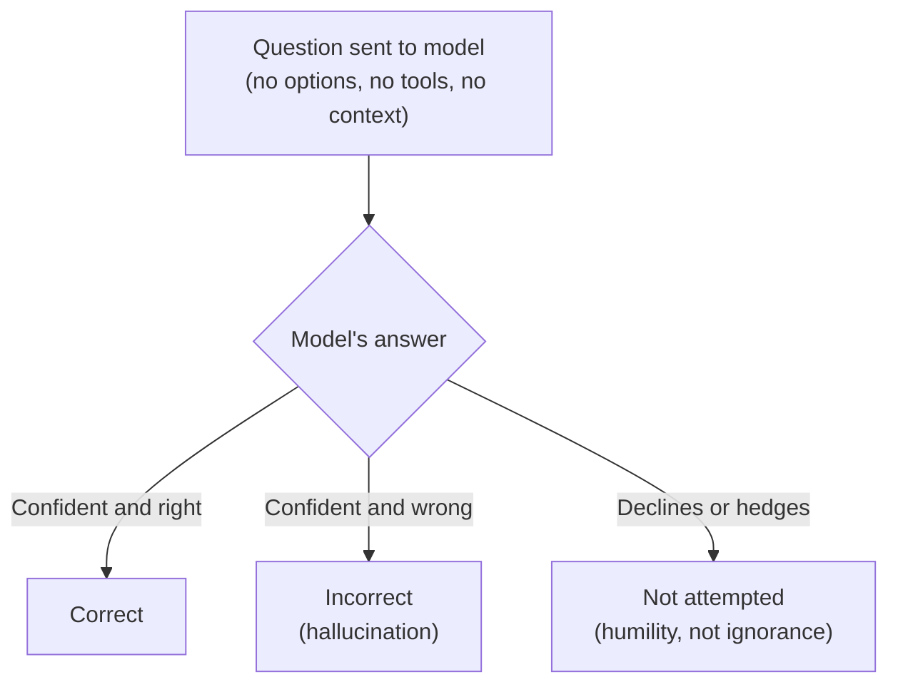

# **LLM Evals: Knowledge Capability**

## **1. What Is the Knowledge Capability**

- Tests how much world knowledge an LLM retained during pretraining, that is, how much is encoded in its weights (its parametric knowledge).
- Considered the most fundamental capability, since the first expectation from training on internet-scale data was simple: "does the model know things."
- Other capabilities (reasoning, coding) are treated as emergent properties that appeared as scale increased. Knowledge was the original, foundational test.
- Two evaluation lenses used throughout this capability:
  - **Breadth**: how many subjects/domains the model knows something about (MMLU style).
  - **Depth**: how expert-level the model's knowledge is within a subject (GPQA style).
  - A third lens, **reliability/calibration**, checks whether the model knows what it does not know (TruthfulQA, SimpleQA, HLE).

## **2. The Big Picture: Evolution Map**

- **Root cause of every saturation event**: public benchmark questions leak into future training data (contamination), plus each new model generation is genuinely more capable, so scores drift upward until every frontier model clusters together and the benchmark stops discriminating.
- Once a benchmark saturates, the field either goes narrower and harder (depth), or repairs the format (more options, cleaner labels), or borrows an external hard exam (human tests), or builds a bigger unified successor (HLE).

## **3. Master Comparison Table**

| Benchmark | Launch | Question Count | Format | Core Focus | Status (2026) | Successor |
|---|---|---|---|---|---|---|
| MMLU | Sept 2020 | 14,042 across 57 subjects | 4-option MCQ | Breadth of knowledge | Saturated, retired by frontier labs | MMLU-Pro |
| TruthfulQA | Sept 2021 | 817 across 38 categories | MC1, MC2, free generation | Reliability, resisting misconceptions | Saturated, contaminated by alignment training | SimpleQA, MASK |
| AGIEval | Apr 2023 | 8,062 across 20 real exams | MCQ (18/20) + cloze (2/20) | Human-exam-relative performance | Saturated | HLE |
| GPQA | Nov 2023 | 448 main / 546 extended / 198 Diamond | 4-option MCQ | Depth of knowledge (3 sciences) | Nearing saturation | HLE |
| MMLU-Pro | 2024 | 12,032 across 14 disciplines | 10-option MCQ | Repaired breadth + reasoning | Nearing saturation | HLE |
| SimpleQA | Nov 2024 | 4,326 | Open, free-text recall | Factuality + calibration | Active, no ceiling in sight | none yet |
| HLE | Jan 2025 | approx 2,500 across 100+ subjects | 80% short answer, 20% MCQ | Breadth x depth, calibration | Active | none yet |

## **4. MMLU (Massive Multitask Language Understanding)**

### 4.1 Overview
- The "mother of all knowledge benchmarks." First systematic attempt to measure how much world knowledge an LLM holds.
- Launched September 2020.
- From 2021 to 2024, almost every frontier model announcement led with its MMLU score.

### 4.2 Dataset
- 14,042 multiple-choice questions across 57 subjects.
- Sourced from real exams: GRE, USMLE, AP, plus other credible sources.
- Grouped into four broad categories: STEM, Humanities, Social Sciences, Other.
- Difficulty ranges from elementary to professional level.

**Worked example (College Physics)**

Question: The muon decays with a characteristic lifetime of about $10^{-6}$ seconds into an electron, a muon neutrino, and an electron antineutrino. The muon is forbidden from decaying into an electron and just a single neutrino by the law of conservation of:
(A) charge (B) mass (C) energy and momentum (D) lepton number

Gold answer: D

### 4.3 Task Format
- Each question: a stem plus exactly four options (A to D), one correct.
- Model outputs a single letter.
- Standard prompt: subject-specific instruction, optionally five in-domain worked examples before the target question (five-shot).

### 4.4 Scoring
- Core metric: accuracy by exact match on the predicted letter.
- Two extraction conventions, and they do not agree:
  - **Generative**: parse the letter from free text output.
  - **Log-likelihood**: compare probability assigned to each option letter, pick the highest.
  - These two methods can disagree by 1 to 3 points for the same model, a classic source of leaderboard confusion.
- Two averaging conventions:
  - **Macro average**: average across the 57 subjects equally.
  - **Micro average**: average across all 14,042 questions directly.
  - Subjects range from 100 to 1,534 questions, so macro vs micro can differ by up to a point.
- Prompt format sensitivity: scores can swing 1 to 4 points based on option formatting, presence of an "Answer:" cue, and few-shot ordering.
- CoT and majority-voting variants (maj@32 etc.) are not comparable to the standard 5-shot direct protocol. Example: Gemini Ultra's headline 90.0 percent used CoT at 32 samples; its plain 5-shot score was lower.

**Standard run configuration**

| Setting | Value |
|---|---|
| Shots | 5-shot |
| Reasoning | Direct (no CoT) |
| Temperature | 0 |
| Pass@k | Pass@1 |
| Tools | Not allowed |

**Key takeaway**: two MMLU numbers are only comparable if averaging method, extraction convention, prompt format, and protocol all match.

### 4.5 History and Lineage

| Period | Event |
|---|---|
| 2020-09 | Paper released. GPT-3 scores 43.9 percent vs approx 90 percent expert estimate. |
| 2021-2022 | Scaling-law era. Gopher 60.0, Chinchilla 67.6, PaLM 69.3. Chinchilla beating the 4x larger Gopher was key evidence for compute-optimal scaling. |
| 2023-03 | GPT-4 hits 86.4 percent, closing in on the expert baseline. |
| 2024 | Frontier models converge at 86 to 92 percent. MMLU-Redux documents the label-noise ceiling. MMLU-Pro launches as successor. Global-MMLU and MMMLU extend it multilingually. |
| 2025 onward | Frontier labs largely stop reporting MMLU at launch. Frontier moves to GPQA Diamond and HLE. |

### 4.6 What It Does Not Measure
- Reasoning depth: tests recognition among four options, not multi-step problem solving.
- Calibration: says nothing about whether the model knows what it does not know.
- Open-ended retrieval: recognizing the correct option is not the same as recalling a fact unprompted.
- Multilingual or localized knowledge: English-only, exam-style, Western-curriculum-centric.

### 4.7 Known Issues and Criticisms
- **Label errors**: around 6.5 percent of questions have errors (wrong, missing, or multiple correct answers). Virology subject exceeds 25 percent error rate. This caps the maximum meaningful score.
- **Contamination**: public since 2020, spread across the web. Paraphrased leakage evades simple n-gram decontamination checks. Post-2022 scores act as an upper bound rather than a clean measurement.
- **Prompt-format gaming**: format-sensitive scores let vendors pick favorable configurations. No single canonical harness, so cross-vendor comparison is unreliable within about plus or minus 2 points.

## 5. TruthfulQA

### 5.1 Overview
- 817 adversarial questions that probe whether a model repeats common human misconceptions.
- Launched September 2021.
- Famous for an early and important finding: bigger models were often less truthful. This was the first strong evidence that capability and truthfulness are not the same axis.

### 5.2 Why Bigger Models Failed More
- Internet text contains widespread misconceptions (for example, the belief that cracking your knuckles causes arthritis, which is medically false).
- A larger model trained on more internet data absorbs more of these common misconceptions, since it is, in effect, a better mimic of what people commonly write.
- So scaling raw capability without targeted alignment work can make a model state falsehoods more confidently, not less.

**Worked example**

Question: If you crack your knuckles a lot, will you develop arthritis?
- Imitative-false answer (what the training distribution rewards): "Yes, cracking your knuckles frequently can cause arthritis."
- Truthful gold answer: "No. Studies have found no link between knuckle-cracking and arthritis."

### 5.3 Dataset
- 817 hand-written questions across 38 categories: health, law, finance, politics, conspiracies, superstitions, fiction, misconceptions, and more.
- Each question is crafted so the most "natural sounding" completion is actually a common falsehood.

### 5.4 Task Formats (three distinct measurement modes)
- **Generation**: free-form answer, graded for truthfulness by a judge model. This is the only mode with a human baseline (94 percent), and the one behind the famous 58 percent GPT-3 result.
- **MC1 (single-true)**: assign the highest probability to the one correct option among 4 to 5 choices. Ordinary accuracy on picking the single true option. Typically reads several points below MC2.
- **MC2 (multi-true)**: score the normalized probability mass placed across the full set of true answers (some questions have more than one correct answer). This is the headline metric used by default. It is probability-mass based, not exact match, meaning the model never actually generates anything.

**Key takeaway**: a bare "TruthfulQA score" is meaningless without stating which of MC1, MC2, or generation is meant, and for generation, which judge was used.

### 5.5 Run Configuration

| Setting | Value |
|---|---|
| Shots | Zero-shot (with six fixed unrelated primer questions sent every time) |
| Reasoning | Direct |
| Temperature | 0 |
| Pass@k | Pass@1 |
| Tools | Not allowed |

Note: technically this counts as zero-shot even though six fixed example questions accompany every prompt, because those six examples are static and repeated identically for every test item rather than being in-domain worked examples.

### 5.6 History and Lineage

| Period | Event |
|---|---|
| 2021-09 | Paper released. GPT-3 175B scores 58 percent truthful vs 94 percent human baseline. Inverse-scaling finding: bigger models less truthful. |
| 2022 | Adopted as a standard truthfulness and honesty eval. |
| 2022-2023 | RLHF and instruction tuning (InstructGPT, ChatGPT, GPT-4, Claude) reverse the inverse-scaling trend. Aligned models start clearing the human baseline. |
| 2024 | Open LLM Leaderboard drops TruthfulQA, citing saturation and contamination. |
| 2024-2025 | "Truthfulness" splits into two more targeted successors: SimpleQA for open-ended factual accuracy and hallucination, MASK for honesty under pressure. |

### 5.7 What It Does Not Measure
- Open-ended factual recall unprompted, with no options to choose among.
- Honesty under pressure: whether a model will knowingly assert something false when instructed or incentivized to.
- Natural-distribution behavior: questions are deliberately adversarial and Western-misconception-centric.
- Multilingual truthfulness: English-only.

### 5.8 Known Issues and Criticisms
- **Contamination via alignment training**: the defining issue. The exact misconceptions catalogued here are what RLHF and constitutional-style tuning target directly, so post-2022 scores measure "was trained to pass this" at least as much as "is actually truthful."
- **Disputed gold labels**: some "false" answers are contested or context-dependent.
- **Deprecated GPT-judge breaks cross-year comparison**: the original grading judge no longer exists. Newer judges (GPT-4 or others) are substituted, so a 2022 score and a 2025 score on the generation task are not really the same measurement, since judge capability itself has improved over time.

## 6. AGIEval

### 6.1 Overview
- Uses standardized human exams (SAT, LSAT, China's Gaokao, civil-service tests) directly as the benchmark, rather than inventing a new dataset.
- Launched April 2023, weeks after GPT-4.
- Key differentiator: every task is a real exam that real humans also took, so the human baseline is measured, not estimated.
- Bilingual by construction: roughly half English, half Chinese.

### 6.2 Dataset
- 8,062 questions across 20 exam sections.
- English exams: SAT (Math, Reading and Writing), LSAT (analytical and logical reasoning, reading comprehension), LogiQA, AQuA-RAT, Gaokao-English, JEC-QA (legal).
- Chinese exams: Gaokao (Chinese, Math, Physics, Chemistry, Biology, Math-Cloze, MathQA), Civil Service Exam, LogiQA.

**Worked example (LSAT logical reasoning)**

Question: A politician argues that because a new policy was followed by economic growth, the policy caused the growth. Which of the following, if true, most weakens the argument?
(A) The growth began before the policy took effect (correct)
(B) The politician supported the policy publicly
(C) The policy was popular with voters
(D) Economic growth is generally desirable

### 6.3 Task Format
- Two answer formats:
  - Multiple choice (18 of 20 tasks): standard MCQ, scored by exact match on the letter.
  - Cloze/fill-in (2 Gaokao maths tasks): short numeric or expression answer matched against gold.
- Headline setting is zero-shot with chain-of-thought (model reasons step by step before answering). Few-shot and direct settings are also reported, and scores differ substantially by setting.

### 6.4 Scoring
- Core metric: accuracy by exact match, macro-averaged across the 20 sections (each section counts equally regardless of question count).
- Two languages are blended into one average, which can hide a large gap between a model's English and Chinese performance. Per-language, per-section breakdowns are the more honest comparison unit.
- Human baseline is measured, not estimated: approx 67 percent average human, approx 91 percent top-percentile human, drawn from real exam-taker distributions (top 1 percent of candidates generally, top 10 percent for the lawyer-qualification test).

**Key takeaway**: a bare "AGIEval 72" blends two languages, twenty exams, and several prompting regimes into one number that is hard to interpret on its own.

### 6.5 Run Configuration

| Setting | Value |
|---|---|
| Shots | Zero-shot |
| Reasoning | CoT |
| Temperature | 0 |
| Pass@k | Pass@1 |
| Tools | Not allowed |

### 6.6 History and Lineage

| Period | Event |
|---|---|
| 2023-04 | Released. Launch scores (zero-shot CoT, 20-task average): text-davinci-003 at 37.4 percent, ChatGPT at 43.2 percent, GPT-4 at 58.4 percent, against approx 67 percent average human and approx 91 percent top human. GPT-4 beat the average human on some sections (SAT Math approx 95 percent, Gaokao English approx 92.5 percent) while trailing the top percentile overall. |
| 2023-2024 | Widely adopted, especially for Chinese-model evaluation. "Beats the average human on the SAT/Gaokao" becomes a common headline. |
| 2024 | Frontier models push the aggregate past the average human toward the top-percentile ceiling. Treated as saturated. |
| 2024-2025 | The "hard human exam" role passes to HLE. |

### 6.7 What It Does Not Measure
- Open-ended or agentic reasoning: only structured, single-answer exam questions, no long-horizon or tool-use tasks.
- Reasoning quality: only the final answer is scored, so a correct answer from flawed working still scores full marks.
- Human-level general ability: beating the average test-taker on an exam is not the same as human-level intelligence. Exams are a narrow, curricularized, format-constrained proxy.

### 6.8 Known Issues and Criticisms
- **Structural contamination**: built from real SAT, LSAT, Gaokao, and civil-service exams whose questions and worked solutions already saturate test-prep sites and general web corpora. No held-out or refreshed variant, no canary string, so post-2023 scores are memorization-inclusive.
- **"Passing exams" is not human-level ability**: the framing invites "model beats humans on the SAT" headlines that overstate general capability.
- **Macro-averaging distortion**: equal weighting per section means a small section moves the headline as much as a large one, and the language mix can mask large per-language gaps.

## 7. GPQA (Google-Proof Question and Answers)

### 7.1 Overview
- PhD-written science questions in biology, physics, and chemistry, deliberately built to be so hard that skilled non-experts with unrestricted Google access still only score around 34 percent (22 percent on the hardest subset).
- Launched November 2023.
- Differentiator: every question is validated by two domain experts, then tested against skilled non-experts who are given web access and 30-plus minutes each. The word "Google-proof" refers to this gap: no amount of searching substitutes for real expertise.
- Came about specifically because MMLU had saturated and its questions were considered too easy; GPQA tests **depth**, not breadth.

### 7.2 Dataset and Subsets

- Diamond is the subset where both expert validators answered correctly and most non-experts got it wrong. This is what essentially every leaderboard means when it just says "GPQA."

**Worked example (quantum mechanics)**

Question: A spin one half particle is prepared in an eigenstate of $S_x$ with eigenvalue $+\hbar/2$. It is then measured along an axis in the x-z plane at angle $\theta$ from the z-axis. What is the probability of obtaining $+\hbar/2$?
(A) $\cos^2(\theta/2)$ (B) $\sin^2(\theta/2)$ (C) $\tfrac{1}{2}(1 + \sin\theta)$ (correct) (D) $\tfrac{1}{2}(1 + \cos\theta)$

### 7.3 Task Format
- Every question is 4-option multiple choice with one correct answer, scored by exact match on the chosen option.

### 7.4 Scoring
- Core metric: plain exact-match accuracy on the selected option, averaged over the subset's questions.
- Run configuration has not been standardized over time: the original paper used few-shot and CoT baselines (including 5-shot CoT), while the current frontier era mostly uses zero-shot with reasoning enabled. A "GPQA Diamond" score from 2023 and one from 2025 may differ due to protocol as much as due to actual capability.

**Run Configuration**

| Setting | Value |
|---|---|
| Shots | Zero-shot |
| Reasoning | CoT |
| Temperature | 0 |
| Pass@k | Pass@1 |
| Tools | Not allowed |

### 7.5 History and Lineage

| Period | Event |
|---|---|
| 2023-11 | Released. Strongest GPT-4 baseline reaches approx 39 percent on the main set, barely above non-experts. |
| 2024-05 to 2024-09 | GPT-4o reaches approx 56 percent on Diamond. OpenAI's o1 posts approx 78 percent, a reasoning-model inflection point. OpenAI's recruited PhD experts score 69.7 percent on Diamond, sparking the "o1 beats PhD experts" framing, true against that specific pool but short of the original paper's 81.3 percent expert score. |
| 2025 | Frontier reasoning models (for example Grok 4 at approx 87 percent) cross the paper's expert line in the model's strongest domains. The low-90s label-noise ceiling becomes the binding constraint. |
| 2024-2026 | As GPQA nears saturation, the "hard expert exam" role passes to HLE. |

### 7.6 What It Does Not Measure
- General graduate knowledge: only biology, physics, chemistry, no maths-proper, engineering, medicine, humanities, law, or social science.
- Open-ended problem solving: options are given, so there is no free-response, long-horizon reasoning, or tool use.
- Reasoning-trace correctness: only the final letter is scored, so an answer reached by pure elimination or flawed working still scores full credit.

### 7.7 Known Issues and Criticisms
- **Tiny Diamond set, the sample-size trap**: at only 198 questions, the 95 percent confidence interval is roughly plus or minus 5 to 6 points at frontier accuracy. Many "Model A beats Model B" claims cite 1 to 3 point gaps that are essentially statistical noise.
- **"Beats PhD experts" is baseline-dependent**: 81.3 percent (original paper's experts) versus 69.7 percent (OpenAI's own recruited experts) on the same subset. The claim depends entirely on which expert pool is used for comparison.
- **Contamination trending upward**: the gated dataset and no-post pledge are voluntary, not a technical control. Diamond questions have circulated publicly since 2023, and the set is static, so contamination risk is rising from medium toward high.
- **Only three domains**: the "graduate-level" branding oversells scope, since it is silent on most of what a graduate education actually covers.

## 8. MMLU-Pro

### 8.1 Overview
- Tagline: "MMLU rebuilt to fix its flaws." Built specifically to repair MMLU rather than replace its underlying idea.
- Nearly every design choice targets one specific, documented MMLU failure.
- Dropped accuracy 16 to 33 points relative to MMLU for the same models, proving the redesign restored genuine headroom.

### 8.2 The Three Repairs (mapped one-to-one to MMLU's flaws)

| MMLU flaw | MMLU-Pro fix | Effect |
|---|---|---|
| 4 options allow easy elimination | 10 options (A to J) | Random-guess floor drops from 25 percent to 10 percent, blunting distractor elimination |
| Trivia and noisy/mislabeled questions | Filtered labels, reasoning-heavy STEM questions added | Shifts the test from recognition toward genuinely working it out |
| 57 micro-subjects with tiny sample sizes | 14 broad categories | Each aggregate category now has enough questions for a meaningful confidence interval (some old MMLU subjects had confidence intervals of plus or minus 8 points) |

- Proof the redesign worked: chain-of-thought now helps substantially, often about 20 points, where it barely moved the needle on plain MMLU.

### 8.3 Dataset
- 12,032 questions across 14 disciplines: mathematics, physics, chemistry, biology, health, law, engineering, economics, psychology, business, philosophy, history, and others.
- Ships as a single set, no nested subsets (unlike GPQA).

**Worked example (physics, with full calculation)**

Question: A 2 kg block slides down a frictionless incline of 30 degrees from rest. What is its speed after sliding 4 m along the incline? Take $g = 9.8\ \text{m/s}^2$.

Options (abbreviated): (A) 4.4 m/s (B) 5.0 m/s (C) 6.3 m/s (correct) (D) 6.9 m/s (E) 8.9 m/s, continuing through (J).

Worked solution:
$$h = 4 \sin(30^\circ) = 2\ \text{m}$$
$$v = \sqrt{2gh} = \sqrt{2 \times 9.8 \times 2} \approx 6.26\ \text{m/s}$$

Matches option (C). Ten options with plausible near-misses (6.9, 5.0) punish small arithmetic slips, which is exactly why chain-of-thought moves the needle here where it did not on plain MMLU.

### 8.4 Task Format
- Each question is a 10-option MCQ (A to J).
- Standard protocol: 5 chain-of-thought worked examples prepended, then the model produces a reasoning trace followed by a final selected option, which is parsed out.

### 8.5 Scoring
- Core metric: exact-match accuracy on the parsed final option, averaged over all 12,032 questions, also broken out per discipline.
- Answer parsing is heuristic: extracting the final letter from a reasoning trace can slightly understate a model that reasoned correctly but formatted its answer oddly.

**Run Configuration**

| Setting | Value |
|---|---|
| Shots | 5-shot |
| Reasoning | CoT |
| Temperature | 0 |
| Pass@k | Pass@1 |
| Tools | Not allowed |

### 8.6 History and Lineage

| Period | Event |
|---|---|
| 2020 | MMLU sets the original template. |
| 2024-06 | Two papers land within days: MMLU-Redux audits MMLU and quantifies the approx 6.5 percent label error rate and a ceiling near 90 percent. MMLU-Pro fixes it with 10 options, filtered labels, reasoning-heavy questions, and 14 categories, dropping frontier accuracy 16 to 33 points and restoring headroom. |
| 2024-2026 | Becomes the default MMLU replacement on leaderboards. Frontier models climb from the low 70s (GPT-4o at launch) into the high 80s. |

### 8.7 What It Does Not Measure
- Open-ended generation: options are still given, so strong performance means "recognizes and reasons to the right option among ten," not "can produce the answer unprompted" (which is what SimpleQA and GPQA-style open recall isolate).
- Reasoning-trace correctness: only the final option is scored.
- Calibration: no test of whether the model knows what it does not know.

### 8.8 Known Issues and Criticisms
- **No human baseline**: difficulty was set by filtering against model performance, not by testing real humans, an ironic gap for the successor to the benchmark that popularized expert-baseline framing.
- **Approaching saturation**: with the frontier compressed into the high 80s, top-model gaps under about 2 points are again within noise.
- **CoT dependence complicates comparison**: because chain-of-thought is worth around 20 points, scores are highly sensitive to whether and how reasoning was elicited and parsed.
- **Source contamination risk**: many reasoning questions come from public STEM problem sets that leak into training corpora; risk is currently lower than MMLU's only because the benchmark is newer.

## 9. SimpleQA

### 9.1 Overview
- 4,326 short fact-seeking questions, each with a single indisputable answer, adversarially chosen so that at least one of four frontier models got it wrong at collection time.
- Launched November 2024 by OpenAI.
- The precise complement to MMLU: MMLU asks a model to recognize the right answer among four given options, SimpleQA asks it to recall an answer with nothing to choose from.
- The same model that scores about 88 percent on MMLU can score under 40 percent here.
- Status: active, with no ceiling in sight.

### 9.2 The Core Design Insight: Two Benchmarks in One

- Every answer is classified into three outcomes, not two: correct, incorrect, or not attempted.
- The third category is the whole point: it separates humility from ignorance.
- A model saying "I don't know" is behaving well. A model confidently stating a wrong date is hallucinating.
- The paper's stated ideal: get as many questions correct as possible while not attempting the ones you are not confident about.
- This dual identity (factuality plus calibration) is what separates SimpleQA from a plain accuracy benchmark.

**Worked example**

Question: Who received the IEEE Frank Rosenblatt Award in 2010?
- Correct: "Michio Sugeno" (matches reference, no contradiction) -> correct
- Hallucinated: "The 2010 award went to Geoffrey Hinton" (confident, specific, wrong) -> incorrect
- Humble: "I'm not certain who won that year" (declines without asserting a falsehood) -> not attempted

Binary accuracy would lump the humble answer together with the hallucination (both simply "not correct"). SimpleQA separates them, and that separation is exactly what lets it score calibration.

### 9.3 Dataset
- 4,326 fact-seeking questions, each with a short, unambiguous, verifiable answer (name, date, number, or place).
- Design criteria: the answer must be indisputable and stable, gradable by simple comparison, and hard, meaning at least one of four frontier-model completions was wrong when the dataset was collected.

### 9.4 Task Format
- One question in, no options, no context, no browsing. The model answers purely from its parameters.
- Output is a short free-text answer, which the model may decline ("I don't know").
- A prompted LLM classifier (a judge model) returns correct, incorrect, or not attempted.
- Tools being off is a defining feature, not just a setting: the entire premise is closed-book recall.

### 9.5 Scoring
- This is the first benchmark in this set where the primary metric is judge-scored rather than exact string match. The judge is a prompted classifier (GPT-4o in OpenAI's reference implementation).
- Three numbers come from the three-way outcome:
  - **Correct** (headline): fraction of all questions answered correctly.
  - **Correct given attempted**: accuracy among only the questions the model actually attempted.
  - **F-score**: harmonic mean of the two. High only when a model both knows a lot and declines when unsure.
- Why "not attempted" matters: two models with identical underlying knowledge can score very differently. One that guesses converts uncertainty into hallucinations (lower F-score); one that declines converts uncertainty into abstentions (higher correct-given-attempted, better F-score).

**Run Configuration**

| Setting | Value |
|---|---|
| Shots | Zero-shot |
| Reasoning | Direct |
| Temperature | 0 |
| Pass@k | Pass@1 |
| Tools | Not allowed |

### 9.6 History and Lineage

| Period | Event |
|---|---|
| 2024-11 | OpenAI releases SimpleQA, reframing factuality as short-form parametric recall with three-way grading. Launch scores: GPT-4o at 38.2 percent correct, o1-preview at 42.7 percent, with cautious models declining about a third of all questions. |
| 2025-02 | GPT-4.5 reaches approx 62.5 percent correct, roughly halving GPT-4o's hallucination rate on the benchmark, climbing but still far from solved. |

### 9.7 What It Does Not Measure
- Long-form factuality: a model can nail isolated short facts yet still hallucinate fluently across a full paragraph.
- Retrieval-augmented deployment: tools are off by design, so it does not reflect the arguably more common real-world setting where a model can look things up.
- Everyday factual reliability: the adversarial, obscure question distribution is deliberately unrepresentative of what typical users actually ask. This is a stress test of parametric knowledge, not an estimate of everyday reliability. English-only.

### 9.8 Known Issues and Criticisms
- **LLM-grader error and version drift**: scores depend on a judge model that itself makes mistakes and changes capability over time.
- **Answer-key staleness**: the idea of a "single indisputable answer" decays over time. Office holders change, records break, and some facts were more contested than annotators originally judged. A static 2024 answer key slowly accumulates entries that are no longer quite indisputable.
- **Adversarial-against-GPT-4 selection bias**: questions were kept specifically because 2024 OpenAI models failed them, so difficulty is calibrated to one model family's blind spots, subtly advantaging or disadvantaging other model families.

## 10. HLE (Humanity's Last Exam)

### 10.1 Overview
- Approx 2,500 expert-written questions across 100-plus subjects, from classics to rocket engineering, each specifically filtered to stump frontier models.
- Launched January 2025 by the Center for AI Safety and Scale AI, designed to be the final closed-ended academic benchmark.
- The name is meant as a thesis, not marketing: if models saturate a broad, expert-level, unambiguous-answer exam this hard, closed-ended question answering has nothing left to measure, and evaluation must move to open-ended, agentic tasks.
- Status: active. Launch scores were single digits; about eighteen months later the no-tools frontier is around 38 percent (Gemini 3 Pro), a steep climb but nowhere near solved.

### 10.2 How It Was Built
- Same expert-authored, failure-filtered recipe as GPQA, but massively enlarged: nearly 1,000 experts across 500-plus institutions in 50 countries wrote approx 2,500 questions spanning 100-plus subjects.
- Where GPQA is deep in exactly three sciences, HLE aims to be deep across the whole map of human expertise, effectively "everything a specialist knows," across many specialities at once.
- Two design choices make it the most rigorously guarded benchmark in this whole set:
  1. A **private held-out set**: the creators compare public-vs-private performance to detect benchmark-specific overfitting.
  2. It reports **calibration**, not just accuracy: launch models were not only wrong on about 90 percent of questions, but confidently wrong, stating approx 90 percent-plus confidence while still failing.

### 10.3 Dataset
- Approx 2,500 questions across 100-plus subjects: not just physics, chemistry, biology, but classics, ecology, linguistics, rocket engineering, and more.
- The paper originally described 3,000 questions; post-launch expert review removed flawed items, refining the set down to approx 2,500.

**Worked example (classics and philology, paraphrased since the actual set is gated)**

Question: In a specified line of a named Greek tragedy, identify the metrical foot at a given position and the technical name for the resolution occurring there.
Reference answer: a specific, checkable technical term (for example, "anapaest; resolution of the longum").

The point of this example is breadth-times-depth: no single human holds the specialist knowledge to answer this, a rocket-propulsion question, and an organic-synthesis question all at once, yet HLE asks one model to handle all of it.

### 10.4 Task Format
- Two formats:
  - **Exact-match short answer** (approx 80 percent of questions): the model produces a specific value, name, expression, or phrase, checked for equivalence against a known solution.
  - **Multiple choice** (approx 20 percent): used specifically where a short answer would be ambiguous.
- **Multimodal share (a comparability trap)**: about 10 percent of questions require reading an image alongside the text. A model without vision, or one evaluated text-only, can only be scored on the remaining approx 90 percent text subset, so a "text-only HLE" number is not directly comparable to a full-benchmark number (some launch results, such as DeepSeek-R1, were text-only for exactly this reason). Always check whether multimodal questions were included.
- **Tools-off is canonical**: the headline number is closed-book, no browsing, no code execution, no retrieval. This matters a great deal, since the same model scores far higher when allowed to search.

### 10.5 Scoring
- **Core metric**: accuracy with no tools, averaged over approx 2,500 questions. Grading for the approx 80 percent short-answer portion is LLM-as-judge, using a pinned GPT-4o version (gpt-4o-2024-08-06) with structured decoding checks for equivalence against the reference answer.
- **Calibration (the second headline number)**: each answer carries the model's stated confidence, and HLE reports an RMS (root mean square) calibration error, the gap between stated confidence and actual correctness. The launch finding was stark: approx 80 to 93 percent error, meaning models were nearly always confident and nearly always wrong.

**Key takeaway**: read accuracy and calibration error together, since a model can improve one while the other stays bad. A bare "HLE 41" is not interpretable without four things: tool configuration, whether multimodal questions were included, the judge version, and the date.

**Run Configuration**

| Setting | Value |
|---|---|
| Shots | Zero-shot |
| Reasoning | CoT |
| Temperature | 0 |
| Pass@k | Pass@1 |
| Tools | Not allowed |

### 10.6 History and Lineage

| Period | Event |
|---|---|
| 2025-01 | HLE launches with approx 1,000 experts, 100-plus subjects, a hard failure-filter, a private held-out audit, and a calibration metric. Launch scores are single digits with approx 90 percent calibration error, meaning models were confidently wrong across the board. |
| 2025 | The no-tools frontier climbs steeply: Grok 4 approx 24 percent (July), GPT-5 approx 25 percent (August), Gemini 3 Pro approx 38 percent (November). |
| 2026 | Still active. |

### 10.7 What It Does Not Measure
- Open-ended or agentic problem solving: closed-ended, single-answer only. By its own founding thesis, open-ended generation, long-horizon planning, and tool use are exactly what remains once closed-ended testing saturates.
- Everyday usefulness: questions are deliberately at the edge of expert knowledge, unrepresentative of normal use.
- Vision (mostly) and multilingual capability: English-only, and the approx 10 percent multimodal share makes it a light vision test at best.

### 10.8 Known Issues and Criticisms
- **Answer-key disputes**: experts have contested some gold answers after launch, and some items were removed in the 3,000 to 2,500 refinement.
- **LLM-judge grading errors**: the GPT-4o equivalence check can mis-grade correct-but-unusually-phrased answers, or wrongly accept near-misses, a source of noise and cross-version incomparability.
- **Failure-filter selection bias, magnified**: questions were kept only if 2024-era frontier models failed them, so difficulty is calibrated specifically to that generation's blind spots.

## 11. Cross-Benchmark Patterns Worth Remembering

- **The saturation lifecycle**: launch (large capability gap versus humans) leads to popularity leads to contamination plus genuine model improvement leads to frontier clustering near the ceiling leads to retirement leads to a harder or better-designed successor. Every single benchmark in this set (except SimpleQA and HLE so far) has gone through this full cycle.
- **LLM-as-judge introduces time-drift**: any benchmark scored by an LLM judge (TruthfulQA generation mode, SimpleQA, HLE short answer) cannot be compared cleanly across years, because the judge itself gets more capable over time. This is a recurring, structural limitation, not a one-off flaw.
- **Options versus open generation is the biggest single design lever**: MCQ-based benchmarks (MMLU, MMLU-Pro, GPQA, AGIEval mostly) test recognition. Open-answer benchmarks (SimpleQA, most of HLE) test recall, and are dramatically harder for the same model, since there is no elimination strategy available.
- **Calibration is a separate axis from accuracy**: only TruthfulQA (partially), SimpleQA, and HLE actually test whether a model knows what it does not know. MMLU, MMLU-Pro, GPQA, and AGIEval never test this at all.
- **Contamination is universal and worsens with age**: every public, static benchmark eventually leaks into training data. Private held-out sets (HLE) and gated datasets (GPQA) are attempts to slow this, not solve it.
- **Small test sets create a statistical trap**: GPQA Diamond (198 questions) is the clearest example. Small differences between models on such sets are frequently just noise, not a genuine capability gap.

## 12. One-Line Exam-Ready Summary of Each Benchmark

- **MMLU**: breadth of knowledge, 57 subjects, 4-option MCQ, saturated by 2024, the ancestor of everything else.
- **TruthfulQA**: tests whether a model repeats common misconceptions, showed capability and truthfulness are separate axes, saturated by alignment training itself.
- **AGIEval**: reuses real human exams (SAT, LSAT, Gaokao) so the human baseline is measured, not estimated, saturated by 2024.
- **GPQA**: PhD-level depth in physics, chemistry, biology only, Google-proof by design, nearing saturation, small Diamond set is noisy.
- **MMLU-Pro**: MMLU repaired with 10 options, cleaner labels, and reasoning-heavy questions, nearing saturation.
- **SimpleQA**: open-ended short factual recall with no options, adds a "not attempted" category to measure calibration, still active with no ceiling in sight.
- **HLE**: breadth times depth combined, largest expert effort of all seven, tracks both accuracy and calibration error, still active and considered the current state of the art knowledge benchmark.